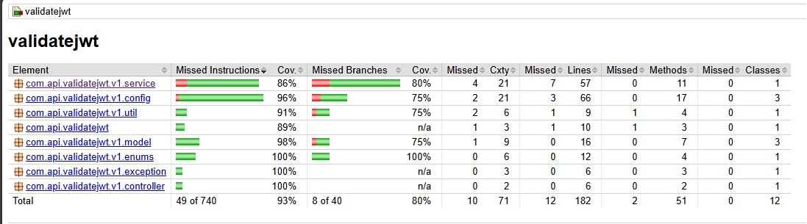

# validatejwt

Projeto para validação de tokens JWT

---

## Índice

- [Introdução](#introdução)
- [Desafio](#desafio)
- [Documentação técnica](#documentação-técnica)
- [Relatório de Cobertura](#relatório-de-cobertura)
- [Estrutura Hierárquica do Projeto](#estrutura-hierárquica-do-projeto)
- [Descrição das Bibliotecas](#descrição-das-bibliotecas)
- [Configuração e Execução](#configuração-e-execução)
- [Features Disponíveis](#features-disponíveis)
- [Exemplos de Logs da Aplicação](#exemplos-de-logs-da-aplicação)
- [Informações Adicionais](#informações-adicionais)
- [Referências e Fontes Externas](#referências-e-fontes-externas)

---

## Introdução

O `validatejwt` é um serviço de API REST construído em Spring Boot, projetado para validar tokens JWT (JSON Web Tokens) conforme regras estritas de formato, claims e negócios. Ele garante que os tokens recebidos estejam devidamente estruturados, possuam claims obrigatórios e válidos, e rejeita tokens malformados, com claims inválidas ou valores fora do padrão estabelecido.

---

## Desafio

Este projeto foi desenvolvido como parte de um desafio técnico proposto em:  
[https://github.com/99h58f2qe/backend-challenge](https://github.com/99h58f2qe/backend-challenge)

---

## Documentação técnica

A documentação completa da API está disponível em:  
[https://michaelcx77.github.io/validatejwt/](https://michaelcx77.github.io/validatejwt/)

---

## Relatório de Cobertura



---

## Estrutura Hierárquica do Projeto

```
/validatejwt
├── src
│   ├── main
│   │   ├── java
│   │   │   └── com.api.validatejwt
│   │   │       ├── v1.config           # Configurações gerais e beans customizados
│   │   │       ├── v1.controller       # Controllers REST (ex: JwtController)
│   │   │       ├── v1.enums            # Enumerações (ex: EnumRole)
│   │   │       ├── v1.exception        # Classes customizadas de exceção
│   │   │       ├── v1.model            # Models/DTOs usados na API (ex: Jwt, JwtDTO, Claim)
│   │   │       ├── v1.service          # Serviços de negócio (ex: JwtService)
│   │   │       └── v1.util             # Utilitários de apoio (ex: ReflectionUtils)
│   │   └── resources
│   │       ├── application.properties  # Configurações da aplicação Spring Boot
│   │       └── logback-spring.xml      # Configuração de logging estruturado
│   └── test
│       └── java                        # Testes automatizados
├── assets
│   └── images                          # Imagens utilizadas na documentação
├── docs
│   ├── output_log_examples             # Exemplos reais de logs gerados pela aplicação
│   └── Insomnia_2025-06-08.yaml        # Coleção de requests para Insomnia
├── pom.xml                             # Arquivo de configuração do Maven
└── README.md                           # (Este arquivo)
```

### Descrição dos principais diretórios e arquivos

- **com.api.validatejwt**: Pacote base do projeto.
- **v1.config**: Beans, configurações e adaptações para o Spring.
- **v1.controller**: Controllers REST. Expõe os endpoints da API.
- **v1.enums**: Enumerações usadas nas validações (ex: roles permitidas).
- **v1.exception**: Exceções customizadas para tratamento de erros.
- **v1.model**: Modelos de dados do domínio e DTOs de entrada/saída.
- **v1.service**: Lógica central de validação do JWT e regras de negócio.
- **v1.util**: Utilitários auxiliares para reflexão, manipulação, etc.
- **resources/application.properties**: Configura propriedades da aplicação, como porta, logs, etc.
- **resources/logback-spring.xml**: Configuração de logging estruturado (Logback e Logstash).
- **docs/output_log_examples**: Exemplos reais de logs de sucesso/erro.
- **docs/Insomnia_2025-06-08.yaml**: Exemplos prontos para testar a API com Insomnia.

---

## Descrição das Bibliotecas

O projeto utiliza as seguintes dependências (definidas em `pom.xml`):

- **Spring Boot Starter Web**: Framework para criação de APIs REST.
- **Spring Boot Starter Validation**: Suporte a validações via anotações.
- **Lombok**: Geração de código boilerplate (getters, setters, etc).
- **Jakarta Validation API**: Validação de beans.
- **Logstash Logback Encoder**: Logging estruturado em JSON para integração com ELK stack.
- **Spring Boot Devtools**: Hot reload para desenvolvimento.
- **JUnit, Spring Boot Starter Test**: Testes automatizados.
- **JaCoCo Maven Plugin**: Geração de relatórios de cobertura de código.

---

## Configuração e Execução

1. **Pré-requisitos**
   - Java 17+
   - Maven 3.8+

2. **Clonando o repositório**
   ```bash
   git clone https://github.com/MichaelCX77/validatejwt.git
   cd validatejwt
   ```

3. **Instalando dependências e compilando**
   ```bash
   mvn clean install
   ```

4. **Executando a aplicação**
   ```bash
   mvn spring-boot:run
   ```
   A aplicação irá rodar por padrão em http://localhost:8080

---

## Validações Disponíveis

### ✅ Válido  
- **JWT válido:** Campo jwt contendo 3 claims válidas: `Name`, `Role` e `Seed`.  

### ⚠️ Casos de erro e validação
- **Claims extras**: JWT possui mais de 3 claims.
- **Claim Name com números**: Exemplo: `"Toninho 123"`.
- **Claim Role inválido**: Valor diferente dos permitidos: `Admin`, `Member`, `External`.
- **Claim Seed não primo**: Valor não é um número primo.
- **Name com mais de 256 caracteres**.
- **Campo extra no payload**: JWT contém campo adicional, ex: `ExtraClaim`.
- **Qualquer dos 3 claims nulos (`null`) ou String vazia (`""`)**.
- **JSON vazio**: Body sem nenhum campo.
- **Campo jwt ausente**.

> Para cada caso acima, a resposta conterá detalhes do erro de validação identificado. Exemplos completos estão no arquivo [docs/HANDSON.md](docs/HANDSON.md).

---

## Exemplos de Logs da Aplicação

Logs estruturados são gerados em formato JSON e podem ser encontrados em:

- [exemple_client_error.json](docs/output_log_examples/exemple_client_error.json)  
- [exemple_failed_validate_payload.json](docs/output_log_examples/exemple_failed_validate_payload.json)  
- [exemple_server_error.json](docs/output_log_examples/exemple_server_error.json)  
- [exemple_success.json](docs/output_log_examples/exemple_success.json)  

Esses arquivos exemplificam logs de requisições bem-sucedidas, falhas de validação de payload, erros do cliente e falhas internas do servidor, respectivamente.

---

## Informações Adicionais

- **Gerar documentação Javadoc**
  ```bash
  mvn javadoc:javadoc
  ```
  Os arquivos gerados estarão em `target/site/apidocs`.
- **Geração automatizada do javadoc automatizada pelo githubactions após o merge na main -> [deploy-javadoc.yml](.github/workflows/deploy-javadoc.yml), é disponibilizada via GithubPages -> [https://michaelcx77.github.io/validatejwt/](https://michaelcx77.github.io/validatejwt/)**

- **Gerar relatório de cobertura de testes**
  ```bash
  mvn test
  mvn jacoco:report
  ```
  O relatório estará disponível em `target/site/jacoco/index.html`.

---

## Referências e Fontes Externas

- [Spring Boot - Documentação Oficial](https://spring.io/projects/spring-boot)
- [JWT.io - Introdução a JSON Web Tokens](https://jwt.io/introduction)
- [Jakarta Bean Validation](https://beanvalidation.org/)
- [Logback e Logstash Encoder](https://github.com/logstash/logstash-logback-encoder)
- [JavaDoc para projetos Maven](https://maven.apache.org/plugins/maven-javadoc-plugin/)
- [JaCoCo - Java Code Coverage](https://www.jacoco.org/jacoco/)

---
